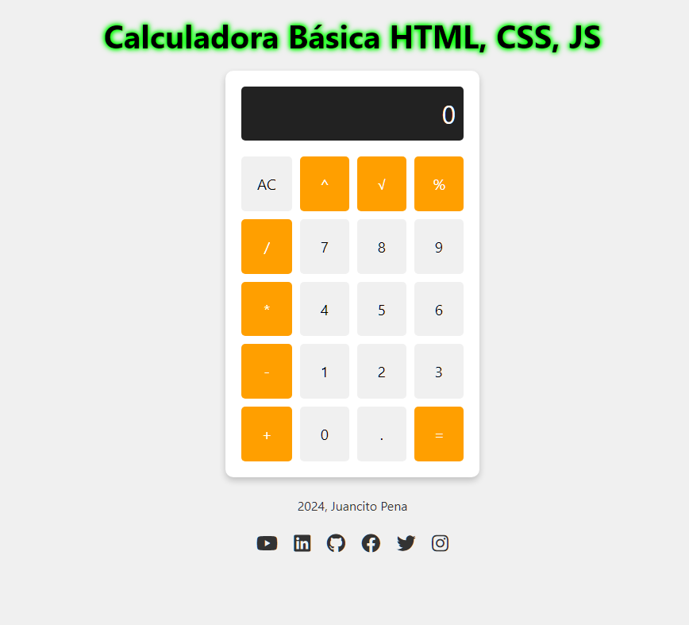

# CALCULADORA_HTML-CSS-JS# Calculadora Web

## Descripción

Este proyecto es una calculadora web simple pero elegante que permite realizar operaciones matemáticas básicas. La calculadora tiene una interfaz gráfica intuitiva, diseñada para ser fácil de usar y visualmente atractiva.



## Características

- **Interfaz de Usuario Amigable**: Diseño limpio y moderno que facilita la interacción.
- **Operaciones Básicas**: Permite realizar sumas, restas, multiplicaciones y divisiones.
- **Entrada de Decimales**: Soporte para números decimales.
- **Botón de Borrado Completo (AC)**: Permite restablecer la calculadora a su estado inicial.
- **Responsive Design**: La calculadora se adapta a diferentes tamaños de pantalla.

## Tecnologías Utilizadas

- **HTML**: Estructura básica de la calculadora.
- **CSS**: Estilos y diseño de la calculadora.
- **JavaScript**: Lógica de la calculadora y manejo de eventos.

## Instalación

1. Clona el repositorio a tu máquina local:
   ```sh
   git clone https://github.com/tu-usuario/calculadora-web.git
   ```

2. Navega al directorio del proyecto:
   ```sh
   cd calculadora-web
   ```

## Uso

1. Abre el archivo `index.html` en tu navegador preferido.
2. Usa la calculadora ingresando números y seleccionando operaciones.
3. El resultado se mostrará en la pantalla de la calculadora.

## Estructura del Proyecto

```
calculadora-web/
│
├── index.html   # Estructura principal de la calculadora
├── styles.css   # Estilos de la calculadora
└── scripts.js   # Lógica y funcionalidad de la calculadora
```

# Calculadora Web

Este proyecto implementa una calculadora web utilizando HTML, CSS y JavaScript. A continuación, se presenta un desglose del código y las buenas prácticas implementadas.

## Componentes Principales

### Variables

- `display`: Referencia al elemento HTML que muestra el resultado.
- `currentOperand`: Almacena el número que el usuario está ingresando.
- `previousOperand`: Almacena el número anterior para operaciones.
- `operation`: Almacena la operación matemática actual.

### Funciones Principales

1. `clearDisplay()`: Limpia el display y reinicia los operandos y la operación.
2. `appendNumber(number)`: Añade un número al operando actual.
3. `chooseOperation(op)`: Establece la operación a realizar.
4. `compute()`: Realiza la operación matemática.
5. `updateDisplay()`: Actualiza el contenido del display.
6. `showError(message)`: Muestra un mensaje de error en un modal.
7. `continueOperation()`: Maneja el cierre del modal de error.

## Validaciones

- Prevención de múltiples puntos decimales.
- Validación de división por cero.
- Validación de raíz cuadrada de números negativos.
- Validación de números demasiado grandes.

## Estructuras de Control

- Condicionales `if` para verificar condiciones específicas.
- Estructura `switch` para realizar cálculos según la operación seleccionada.

## Buenas Prácticas Implementadas

1. **Separación de Concerns**: Funciones claramente separadas por propósito.
2. **Validación de Entrada**: Prevención de errores comunes.
3. **Actualización del Display**: Función dedicada para reflejar el estado actual.
4. **Manejo de Errores**: Uso de modales para mostrar mensajes de error.
5. **Conversión Segura de Tipos**: Uso de `parseFloat` para conversión de cadenas a números.
6. **Redondeo de Resultados**: Uso de `Math.round` para evitar problemas con números muy largos.

## Implementación

El código refleja estas buenas prácticas a través de:

- Funciones con responsabilidades claras.
- Validación robusta de entradas y operaciones.
- Manejo elegante de errores mediante modales.
- Aseguramiento de la precisión de resultados con técnicas de redondeo y conversión de tipos.

Este enfoque modular y estructurado facilita la lectura y mantenimiento del código, además de mejorar la experiencia del usuario al proporcionar una interfaz clara y respuestas adecuadas a las entradas.

## Capturas de Pantalla

[Aquí puedes agregar capturas de pantalla de tu calculadora]

## Contribuciones

Las contribuciones son bienvenidas. Puedes hacerlo de la siguiente manera:

1. Haz un fork del proyecto.
2. Crea una nueva rama (`git checkout -b feature/nueva-funcionalidad`).
3. Realiza tus cambios y haz commit (`git commit -am 'Añade nueva funcionalidad'`).
4. Sube tus cambios (`git push origin feature/nueva-funcionalidad`).
5. Abre un Pull Request.

## ⭐ Invítame una Estrella ⭐

Si te gusta este proyecto, no olvides darle una estrella en GitHub. ¡Tu apoyo es muy importante y me motiva a seguir mejorando!

Ver Proyecto Funcionando:https://github.com/JUANCITOPENA/CALCULADORA_HTML-CSS-JS

## 📜 Licencia

Este proyecto está licenciado bajo la Licencia MIT. Para más información, consulta el archivo [LICENSE](LICENSE).

## 🔔 Sígueme en GitHub

Para estar al tanto de mis últimos proyectos y actualizaciones, sígueme en GitHub.

https://github.com/JUANCITOPENA/CALCULADORA_HTML-CSS-JS

## 🤝 Comparte
